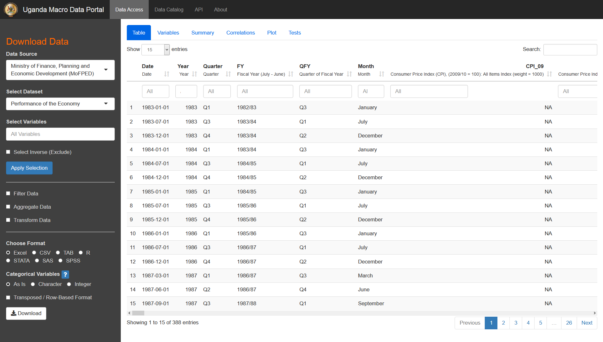
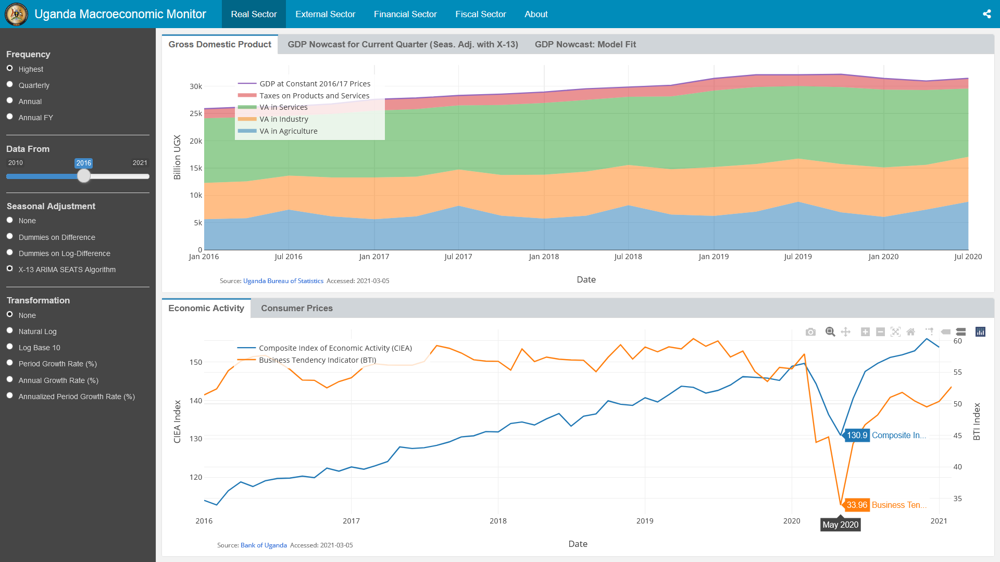

```{r setup, include=FALSE}

# Settings
POE_date = as.Date("2021-05-15")  # Keep it the 15th of each month, to avoid borderline cases when calculating on dates.
from_date = as.Date("2020-04-15") # One month before (data is dated on first of each month)
web = FALSE
web_JS = web
dynamic_ticks = FALSE # FALSE recommended unless graph is distorted because of static ticks.

knitr::opts_chunk$set(echo = FALSE, error = FALSE, warning = FALSE, message = FALSE,
                      cache = FALSE, out.width = '100%', fig.height = if(web) 5 else 4,
                      fig.pos = "H", out.extra = "")

source("POE functions.R")
library(ugatsdb)
ugatsdb_reconnect()
library(kit, include.only = "psum")
library(kableExtra)

# Read POE data from database (21 month before)
data <- get_data('MOF_POE', from = from_date - 365L - 31L, to = POE_date)
data_ft <- fsubset(data, between(Date, from_date, POE_date))
data_lag <- fsubset(data, between(Date, from_date - 31L, POE_date - 31L))

# Saving the data download
wide2excel(data, path = paste("POE", year(POE_date), substr(POE_date, 6, 7), 
                              toupper(month.abb[month(POE_date)]), "DATA.xlsx", sep = "-"), 
           transpose = TRUE)

# This is needed for a graph
fy <- as.character(expand_date(c(from_date, POE_date), gen = "FY")[[2L]])
```

<!-- For Web-Version: Include logo -->

```{r, echo=FALSE, eval=web}

htmltools::img(src = knitr::image_uri("images/MOF_logo_600px_transparent_noborder.png"), 
               width = "20%",
               alt = 'logo', 
               style = 'position:absolute; top:0; right:20px; padding:10px;')
```

<!-- For Web-Version: Some CSS styling options -->

```{css, echo=FALSE, eval = web}

body {
  font-size: 14px; 
  /* background-color: #444647;  #4e4f51; #204a6f; #104e8b;  #f2f2f2; */
}
.toc-content {
  background-color: #ffffff; /* #fbfbfb; */
}
/*
.tocify {
  border: 0;
}
*/
.tocify-subheader .tocify-item { 
  background-color: #d9dcde; /* #d3d8db; #c9ced1; #c8c8c8; #d2d2d2; #f2f2f2; */
}
.list-group-item.active { 
  background-color: #337ab7;
}
h1.title {
  font-size: 38px;
}
h1 {
  font-size: 28px;
}
h2 { 
  font-size: 22px;
}
h3 {
  font-size: 18px;
}
caption { 
  font-weight: bold;
  font-size: 15px;
}
th { 
  white-space: nowrap;
}
```

<!-- For PDF-Version: Generate cover page -->

```{r frontpage, include=FALSE, eval=!web}

# Background
p <- 
  readRDS("data/BOU_MMI_frontpage.rds") %>% 
  sbt(Date > "1999-06-01", -PDD, -TBILL, -CIC, -E_EP, -FXR) %>% # -TBOND, -PTSD, -DLG
  melt(1L, na.rm = TRUE) %>%
ggplot(aes(x = Date, y = value, colour = variable)) + 
  geom_line() + 
  scale_color_manual(pal = viridis::viridis_pal(option = "D")) + 
  scale_x_continuous(breaks = extended_breaks(20), expand = c(0,0)) +
  scale_y_continuous(breaks = extended_breaks(20), expand = c(0.07,0)) + # 0.1
  theme_void() + guides(colour = FALSE) +
  theme(axis.text = element_blank(),
        axis.title = element_blank(), 
        plot.margin = margin(0,0,0,0)) 

# Shifters
y_s <- -0.05
y_s2 <- 0
x_s <- 0

# Text
library(grid)
text <- grobTree(textGrob("PERFORMANCE OF THE ECONOMY", x=0.05+x_s,  y=0.95+y_s, hjust=0, vjust = 0.5,
                          gp = gpar(col="grey35", fontsize=30, fontface="bold")),
                 textGrob("MACROECONOMIC POLICY DEPARTMENT", x=0.0657+x_s,  y=0.275+y_s2, hjust=0, vjust = 0.5,
                           gp = gpar(col="dodgerblue4", fontsize=20), rot = 90),  
                 textGrob("MONTHLY REPORT", x=0.05059+x_s,  y=0.9175+y_s, hjust=0, vjust = 0.5, 
                           gp = gpar(col="grey60", fontsize=25)), 
                 textGrob(paste(toupper(month.name[month(POE_date)]), year(POE_date)), 
                          x=0.0512+x_s,  y=0.8801+y_s, hjust=0, vjust = 0.5,   
                          gp = gpar(col="dodgerblue4", fontsize=20, fontface="bold")), 
                 textGrob("MINISTRY OF FINANCE\nPLANNING AND\nECONOMIC DEVELOPMENT", 
                           x=0.1+0.165+x_s,  y=0.6325+y_s2, hjust=0, vjust = 0.5, # x += 0.165 to have logo left. 
                           gp = gpar(col="grey35", fontsize=20, lineheight = 1)),  
                 textGrob("www.mepd.finance.go.ug", x=0.5,  y=0.021,  
                          hjust=0.48, vjust = 0.5, 
                          gp = gpar(col="grey20", fontsize=10))) 
# MoFPED logo
library(png)
img <- readPNG("images/MOF_logo_600px_transparent_noborder.png", TRUE)
logo_large <- grobTree(rasterGrob(img, x=0.1,  y=0.633, hjust=0, vjust = 0.5, # below: x=0.1,  y=0.45, left: x=0.1,  y=0.633, right: x=0.56,  y=0.633
                            width = unit(6, "lines"), height = unit(6, "lines"), 
                            interpolate = FALSE))

# Save plot
pdf("cover.pdf", width = 8.27, height = 11.69)
p + annotation_custom(text) +  annotation_custom(logo_large) 
dev.off()
```

<!-- For PDF-Version: Insert cover page, automatic table of contents, list of tables and list of figures -->

```{r, echo=FALSE, eval = !web, results="asis"}

cat("
\\includepdf[page=-]{cover.pdf}
\\pagenumbering{Roman}
\\tableofcontents
\\newpage
\\listoftables
\\listoffigures
\\setstretch{1.35} 
\\newpage
") # Setstretch sets the line spacing (use 1.25 for a bit more compact)
```

<!-- +++ Content Starts Here +++ -->

`r if(web){"***"}`
# Summary^[Data on Private Sector Credit, CIEA and External sector has a lag of one month.]
`r if(web){"***"}`
  
  
## Real Sector
-	Annual headline inflation increased further in March 2021 to 4.1% from 3.8% in February 2021, largely driven by an increase in prices for some food crops and charcoal.

-	High frequency economic indicators indicate continued improvements in economic activity during February and March 2021, while sentiments about doing business – going forward remain positive.


## Financial Sector
-	The Ugandan Shilling appreciated by 0.1% against the US Dollar, trading at an average midrate of Shs 3,662.87/US\$ in March 2021 from Shs 3,667.32/US\$ in February 2021 as inflows mainly from offshore investors and exporters outstripped demand for the dollar.

-	There was a spike in lending rates in February 2021 compared to the previous two months, which is considered as a market correction. Weighted average lending rates rose by 2.5 and 0.6 percentage points during the month for shilling denominated and foreign currency denominated credit, respectively.

-	Interest rates across all Treasury Bill tenors continued a downward trend in March 2021, partly explained by the high demand for Government securities caused by availability of excess liquidity in the money markets. On average, annualised rates were recorded at 7.2%, 10.4% and 11.7% for the 91-, 182- and 364-day tenors, respectively.

-	The stock of outstanding private sector credit declined for the first time since August 2020 to Shs 17,896.92 billion in February from Shs 17,911.52 billion the previous month, as loan repayments exceeded credit extension during the month.


## External Sector
-	Uganda traded with the rest of the world at a deficit of US$ 178.09 million in February 2021. This deficit was however lower than the previous month and the same month a year ago as export receipts grew at a faster rate than the import bill during the period.

-	Export earnings increased by 8.9% to US\$ 447.05 million in February 2021 from US\$ 410.40 million in January 2021 as export volumes increased. The import bill also increased during the month, albeit at a smaller rate of 3%.  The value of imports in February was US\$ 625.14 million, up from US\$ 607.20 million the previous month.


## Fiscal Sector
-	Fiscal operations during March 2021 resulted in a deficit of Shs 366.90 billion which is lower than Shs 612.76 billion planned for the month. This is attributed to lower than planned spending during the month which also offset shortfalls registered in revenue and grants.

-	Domestic revenue collections amounted to Shs 1,646.96 billion, registering a shortfall of Shs 142.23 billion or 8% against the month’s target. Low profitability and employment levels affected direct tax collections, while indirect taxes were affected by implementation challenges for some of the policy measures.

-	Total Government spending during the month was Shs 2,037.01 billion. This was 16.8% lower than what had been planned for the month owing to the underperformance in externally financed development spending (including on Hydro Power Projects).


## East African Community
-	Annual headline inflation edged upwards within the EAC except for Tanzania. Kenya and Rwanda’s inflation increased to 5.9% and 2.0% in March 2021 from February’s 5.8% and 1.6% respectively. On the other hand, Tanzania’s inflation declined to 3.2% from 3.3% in that period.

-	Uganda’s exports to the rest of EAC Partner States increased by 8.7% to US\$ 111.65 million in February 2021 from US\$ 102.73 million the previous month. Imports from the region also increased by 1.6% to US\$ 160.78 million in March from US\$ 158.30 in January 2021. As a result, Uganda’s trade deficit with the EAC narrowed to US\$ 49.13 million, its lowest levels since October 2020.


`r if(!web){"\\newpage\n\\pagenumbering{arabic}"}`
`r if(web){"***"}`
# Real Sector Developments
`r if(web){"***"}`

## Inflation

**Annual headline inflation** was recorded at 4.1% in March 2021, up from the 3.8% registered the previous month.  This increase was attributed to a rise in food crops and related items inflation as well as energy, fuels and utilities (EFU) inflation, which more than offset the fall in core inflation.

```{r REAL_INF, fig.cap = if(!web) "Inflation [Headline \\& Core] (Source: UBoS)" else NULL}

INF <- get_vars(data_ft, c('Date', 'INF_16', 'INF_CORE_16', 'INF_FOOD_16', 'INF_EFU_16')) %>%
       ftransformv(-1L, `/`, 100)

lineplot(INF, 
         title = if(web) "Inflation [Headline & Core] (Source: UBoS)" else NULL,
         series = .c(INF_16, INF_CORE_16),
         labels = c("Headline (Base: 2016/17 = 100)", "Core (Base: 2016/17 = 100)"),
         colours = "Paired",
         hline = 0,
         y.labels.format = function(x) percent(x, drop0trailing = TRUE),
         point.labels.format = function(x) percent(x, 0.1),
         point.labels.direction = 'y',
         point.labels.seed = 101,
         interactive = web_JS,
         dynamic.ticks = dynamic_ticks,
         hoverformat = ".1%")
```

Annual inflation for food crops and related items increased from minus 4.3% in February 2021 to minus 0.9% in March 2021. Generally, prices increased between February and March 2021 but still remained lower as compared to the same period last year.  At the same time, the annual energy, fuels and utilities inflation increased to minus 0.8% in March 2021 from minus 2.6% in February 2021, following rising charcoal prices.

On the other hand, annual core inflation declined in March 2021 to 5.3% from 5.6% in February 2021. The decline was partly attributed to reductions in public transportation charges (taxi, bus & motorcycle fares) as the effect of the Standard Operating Procedures (SOPs) in this sector dissipate.

```{r REAL_INF2, fig.cap = if(!web) "Inflation [Food and EFU] (Source: UBoS)" else NULL}

lineplot(INF, 
         title = if(web) "Inflation [Food and EFU] (Source: UBoS)" else NULL,
         series = .c(INF_FOOD_16, INF_EFU_16),
         labels = c("Food Crops", "EFU (Energy, Fuel and Utilities)"),
         colours = "Paired",
         hline = 0, 
         y.labels.format = function(x) percent(x, drop0trailing = TRUE),
         point.labels.format = function(x) percent(x, 0.1), 
         point.labels.direction = 'y', 
         point.labels.seed = 105,
         interactive = web_JS,
         dynamic.ticks = dynamic_ticks,
         hoverformat = ".1%")
```

On a month-on-month basis, there were price increases for some food items including milk & its products, meat, bananas, passion fruit, papaya, watermelon, mango, cabbages, tomatoes, egg plants and peas between February and March 2021.  The increase in prices partly reflects reductions in supply as most vegetables and some fruits are out of season. In addition, there was increased demand occasioned by the re-opening of schools.

## Economic Activity

The Purchasing Managers Index (PMI) survey indicated an improvement in economic activity of the private sector in March 2021. The index was registered at 53.2 in March 2021 up from 51.2 for the previous month. This was attributed to rising new orders which implies improvement in aggregate demand, as well as increase in output by businesses as they gradually return to a more normal economic environment. The improvement in economic activity during the month was registered in all sectors of the economy and resulted in improvement in employment levels.

```{r REAL_PMI, fig.cap = if(!web) "Economic Activity [PMI] (Source: Stanbic Bank Uganda)" else NULL}

lineplot(data_ft,
         title = if(web) "Economic Activity [PMI] (Source: Stanbic Bank Uganda)" else NULL,
         series = "PMI", 
         labels = "PMI (Purchasing Managers Index)", 
         colours = "Set1",
         hline = 50,
         point.labels.direction = 'y', 
         point.labels.seed = 108,
         interactive = web_JS, 
         dynamic.ticks = dynamic_ticks)
```

The Composite Index of Economic Activity (CIEA) was recorded at 154.5 in February 2021 up from the 154.1 registered in the previous month, indicating a slight upturn in economic activity following a slowdown caused by the uncertainties related to the January 2021general elections.

```{r REAL_CIEA, fig.cap = if(!web) "Economic Activity [CIEA] (Source: BoU)" else NULL}

lineplot(data_lag,
         title = if(web) "Economic Activity [CIEA] (Source: BoU)" else NULL,
         series = "CIEA",
         labels = "CIEA (Composite Index of Economic Activity)",
         colours = "Spectral", 
         point.labels.direction = 'y', 
         point.labels.seed = 10,
         interactive = web_JS,
         dynamic.ticks = dynamic_ticks)
```

The Business Tendency Index (BTI) remained above the 50-mark threshold in March 2021, an indication of optimism about the business environment. The BTI is forward looking and the recording of 52.04 during the month indicates optimism regarding doing business in the next three months. The optimism is borne out of the continued recovery in economic conditions following the easing of restrictions related to Covid-19. The sectors where business people and investors reported the most optimism included manufacturing, wholesale trade and agriculture.

```{r REAL_BTI, fig.cap = if(!web) "Economic Perceptions as shown by BTI (Source: BoU)" else NULL}

lineplot(data_ft,
         title = if(web) "Economic Perceptions as shown by BTI (Source: BoU)" else NULL,
         series = "BTI", 
         labels = "BTI (Business Tendency Indicator)", 
         colours = "Dark2",
         hline = 50, 
         point.labels.direction = 'y', 
         point.labels.seed = 1011,
         interactive = web_JS,
         dynamic.ticks = dynamic_ticks)
```


`r if(web){"***"}`
# Financial Sector Developments
`r if(web){"***"}`

## Exchange Rate Movements

In the foreign exchange market, the Shilling faced appreciation pressures against the major global currencies during the month but remained relatively stable.  The Shilling traded at an average midrate of Shs 3,662.87/US\$ in March 2021 compared to Shs 3,667.32/US\$ in February 2021, resulting in an appreciation of 0.1%. Similarly, the Shilling appreciated by 0.1% and 1.8% against the Pound Sterling and the Euro respectively.

```{r FIN_E, fig.cap = if(!web) "Exchange Rates (Source: BoU)" else NULL}

lineplot(data_ft,
         title = if(web) "Exchange Rates (Source: BoU)" else NULL,
         series = .c(E_GBP, E_EUR, E_USD), 
         labels = c("UShs/GBP", "UShs/Euro", "UShs/USD"),
         colours = "Set1",
         line.shapes = TRUE,
         legend.ncol = 3, 
         y.nbreaks = 10, 
         y.labels.format = function(x) dollar(round(x), prefix = NULL), 
         point.labels.direction = 'y', 
         point.labels.seed = 108, 
         interactive = web_JS,
         dynamic.ticks = dynamic_ticks, 
         hoverformat = ",.0f") # limits = c(3000, 5400)
```

The developments in the market were attributed significant foreign exchange inflows from the exports sector and offshore investments in the securities market amidst subdued demand.

## Interest Rate Movements

In March 2021, the Central Bank Rate (CBR) was 7.0%, the same rate it has been since June 2020 as the Central Bank seeks to continue supporting the economic recovery process.

```{r FIN_I, fig.cap = if(!web) "Interest Rates (Source: BoU)" else NULL}

FSD <- get_vars(data_ft, c('Date', 'I_BOU_CBR', 'I_BA_UGX_L', 'I_BA_FC_L', 
                           'I_TBILL_AY_91', 'I_TBILL_AY_182', 'I_TBILL_AY_364')) %>%
                ftransformv(-1L, `/`, 100)

lineplot(FSD,
         title = if(web) "Interest Rates (Source: BoU)" else NULL,
         series = .c(I_BOU_CBR, I_BA_UGX_L, I_BA_FC_L), 
         labels = c("CBR (Central Bank Rate)", "Lending Rate (UShs)", "Lending Rate (FX)"),
         colours = "Paired", 
         line.shapes = TRUE,
         hline = 0,
         legend.ncol = 3, 
         y.nbreaks = 7,
         y.labels.format = function(x) percent(x, drop0trailing = TRUE),
         point.labels.direction = 'y', 
         point.labels.seed = 1010,
         interactive = web_JS, 
         dynamic.ticks = dynamic_ticks,
         hoverformat = ".1%")
```

### Lending Rates^[Data comes with a month lag.]

There was an increase in lending rates charged on both the Shillings and foreign currency denominated credit in February 2021 compared to the previous month. Lending rates on shilling denominated credit rose to a weighted average of 19.9% in February 2021 from 17.4% in January 2021, while the rate on foreign currency denominated loans rose to an average of 5.3% from 4.7% over the same period.

The spike in the average lending rates in February 2021 was a market correction factor and follows the dip in average lending rates during December 2020 and January 2021.  The dip in rates resulted from significant corporate sector activities in the credit markets which had a significant bearing on average lending rates during the two months. 

## Government Securities

During the month, Government held two T-Bill auctions and one T-Bond auction. From these auctions, Shs 901.21 billion (at cost) was raised, of which Shs 440.11 billion was from T-Bills and Shs 461.11 billion was from T-bonds.
Securities worth Shs 479.09 billion were issued for the refinancing of maturing debt whilst Shs 422.12 billion went towards financing other items in the Government budget.

```{r FIN_GS, results = 'asis'}

# Government securities
GS_tab <- data_ft %>% get_vars(c('Date', 'GS_TOT', 'GS_DB', 'GS_REF')) %>%
          expand_date %>%
          collap(GS_TOT + GS_DB + GS_REF + Year + Month ~ FY + QFY,
                 list(fsum, fNobs, flast), flast)
# Part 1
GS_tab1 <- fsubset(GS_tab, fNobs.GS_DB == 3L, FY, QFY, fsum.GS_TOT, 
                   fsum.GS_DB, fsum.GS_REF) %>%
           tail(2L) %>% rm_stub("fsum.") %>%
           ftransform(Yearmon = paste(QFY, FY), FY = NULL, QFY = NULL)

# Part 2: Missing switch bond
GS_tab2 <- gvr(GS_tab, "flast") %>% flast(drop = FALSE) %>% rm_stub("flast.") %>%
           ftransform(Yearmon = paste(Month, Year), Year = NULL, Month = NULL)
# Part 3
GS_tab3 <- GS_tab[FY == flast(FY),
                  list(GS_TOT = fsum(fsum.GS_TOT), 
                       GS_DB = fsum(fsum.GS_DB), 
                       GS_REF = fsum(fsum.GS_REF),
                       Yearmon = paste("FY", flast(FY), "to date"))]

GS_tab <- rbind(GS_tab1, GS_tab2, GS_tab3) %>%
          colorder(Yearmon, GS_TOT, GS_DB, GS_REF)

rm(GS_tab1, GS_tab2, GS_tab3)

names(GS_tab) <- c("", "Total Issuances",
                   "Domestic Borrowing for Fiscal Purposes",
                   "Refinancing")

tab <- kbl(GS_tab, format = if(web) "html" else "latex",
           caption = 'Breakdown of Government Securities (Shs Billion) (Source: MoFPED)',
           digits = 2, 
           format.args = list(big.mark = ",", drop0trailing = TRUE),
           booktabs = TRUE, 
           linesep = "", 
           escape = FALSE, 
           table.attr = "style='width:80%;'") %>%
           kable_styling(latex_options = "HOLD_position") %>%
           row_spec(0, bold = TRUE) %>%
           column_spec(3, width = "7.5em") %>%
           # row_spec(3, italic = TRUE) %>%
           add_indent(3)

if(web) {
    tab %>%
    kable_classic("striped", # "hover"
                  # full_width = FALSE,
                  html_font = "helvetica") %>%
    kable_styling(bootstrap_options = "condensed",
                  font_size = 12)
} else tab
```

```{r FIN_GS2, fig.cap = if(!web) "Breakdown of Government Securities (Shs Billion) (Source: MoFPED)" else NULL}

barplot(data_ft,
        title = if(web) "Breakdown of Government Securities (Shs Billion) (Source: MoFPED)" else NULL,
        series = .c(GS_REF, GS_DB), 
        labels = c('Refinancing', 'Net Domestic Financing'),
        colours = "Paired", 
        hline = 0, 
        y.nbreaks = 10, 
        y.labels.format = function(x) round(x, 1), 
        point.labels.size = 10,
        interactive = web_JS,
        dynamic.ticks = dynamic_ticks, 
        expand = expansion(mult = 0.06))
```

## Treasury Bills

During the month, yields (interest rates) continued to trend downwards. The decline in yields was partly explained by increased demand for these tenors. The annualised yields for March were 7.18%, 10.45% and 11.70% for the 91-, 182- and 364-day tenors, respectively. This compares with 7.78%, 10.89% and 12.32% recorded during February 2020.

```{r FIN_TBILL, fig.cap = if(!web) "Treasury Bill Yields (Source: BoU)" else NULL}

lineplot(FSD, 
         title = if(web) "Treasury Bill Yields (Source: BoU)" else NULL,
         series = .c(I_TBILL_AY_91, I_TBILL_AY_182, I_TBILL_AY_364),
         labels = c("91 Days", "182 Days", "364 Days"),
         colours = "Set1", 
         line.shapes = TRUE,
         legend.ncol = 3, 
         y.nbreaks = 10,
         y.labels.format = function(x) percent(x, drop0trailing = TRUE, accuracy = 0.1),
         point.labels.direction = 'y', 
         point.labels.seed = 37,
         interactive = web_JS, 
         dynamic.ticks = dynamic_ticks,
         hoverformat = ".1%")
```

```{r FIN_ABC, fig.cap = if(!web) "Average Bid to Cover Ratio (Source: MoFPED)" else NULL}

barplot(data_ft,
        title = if(web) "Average Bid to Cover Ratio (Source: MoFPED)" else NULL,
        series = "BCR_AVG", 
        labels = "Average Bid to Cover Ratio",
        colours = "PiYG",
        hline = 0, 
        y.nbreaks = 7, 
        y.labels.format = function(x) round(x, 2), 
        interactive = web_JS, 
        dynamic.ticks = dynamic_ticks,
        hoverformat = ".2f", 
        limits = c(0, 3))
```

### Yields on Treasury Bonds
Two T-Bond tenors (i.e 3-year and 10-year) were reopened^[Reopening a bond instrument refers to issuing additional amounts of a previously issued bond instrument. The reopened instrument has the same maturity date and coupon interest rate, as the original instrument, but with a different issue date and usually a different purchase price.] in one auction during the month. The Yield to Maturity (YTM) on the 3-year tenor reduced to 13.80% in March as compared to 15.75% for a similar instrument in January 2021, whereas, the rate on the 10-year tenor decreased to 15.97% in March from 16.00% in February 2021.

## Outstanding Private Sector Credit^[Data on private sector credit has a lag of one month.]

During the month of February 2021, the stock of outstanding private sector credit declined for the first time since August 2020. The stock was recorded at Shs 17,896.92 billion during February 2021, which was slightly lower (by 0.1%) than the Shs 17,911.52 billion recorded the previous month.

```{r FIN_PSC, fig.cap = if(!web) "Outstanding Private Sector Credit (Shs Trillion) (Source: BoU)" else NULL}

barplot(data_lag,
        title = if(web) "Outstanding Private Sector Credit (Shs Trillion) (Source: BoU)" else NULL,
        series = .c(PSC_FX, PSC_UGX), 
        labels = c("FX Denominated Credit", "UShs Denominated Credit"),
        colours = if(web) "Set1" else "YlOrRd", 
        hline = 0, 
        y.nbreaks = 10, 
        y.labels.format = function(x) dollar(x, prefix = ""),
        point.labels.size = 10,
        interactive = web_JS,
        dynamic.ticks = dynamic_ticks, 
        hoverformat = ",.2f",
        limits = c(0, 19))
```

This was in spite of more credit being extended in February 2021 than in January 2021 and implies increased loan repayment during the month. As economic conditions continue to improve, more borrowers have been able to service and pay back their loans. 

```{r FIN_PSC_Growth, fig.cap = if(!web) "Monthly Growth of Private Sector Credit" else NULL}

data %>% fselect(Date, PSC) %>%
  G(t = ~ Date, scale = 1, stubs = FALSE) %>%
  tail(13L) %>%
  
lineplot(title = if(web) "Monthly Growth of Private Sector Credit" else NULL,
         labels = "Stock of Outstanding Private Sector Credit (MoM % Change)",
         colours = "PRGn", 
         hline = 0, 
         y.nbreaks = 10,
         y.labels.format = function(x) percent(x, accuracy = 0.1),
         point.labels.seed = 1010,
         interactive = web_JS,
         dynamic.ticks = dynamic_ticks, 
         hoverformat = ".1%")
```


## Credit Extensions^[Data on private sector credit has a lag of one month.]

There was an increase in the value of credit extended in February 2021 to Shs 748.06 billion from Shs 533.88 billion the previous month. This followed a resumption of normal operations by lending institutions after the disruptions caused by election-related activities in January. The biggest growth was recorded in Personal & Household loans (84%) followed by Mortgage, Construction & Real Estate (77%) and Trade (58%) sectors. 

```{r FIN_CEA, fig.height=5.5, fig.cap = if(!web) "New Credit Extensions Approved (Shs Trillion) (Source: BoU)" else NULL}

PSC <- data_lag %>% tail(2L) %>%
  get_vars(c('Date','PSC_AGR','PSC_MIN','PSC_MAN','PSC_WRT','PSC_TCEW',
             'PSC_BMCR','PSC_BCOS', 'PSC_PHL')) %>%
  setNames(gsub("Total Credit to Private Sector: | \\(UGX trillions)", "", vlabels(.))) 

barplot(PSC,
        transpose = TRUE, 
        position = position_dodge(0.9),
        title = if(web) "New Credit Extensions Approved (Shs Trillion) (Source: BoU)" else NULL,
        colours = "Paired", 
        hline = 0,
        text.size = if(web) 12 else 10,
        legend.position = "top", 
        x.labels.right = FALSE,
        y.nbreaks = 10, 
        point.labels.size = if(web) 11 else 10,
        point.labels.format = function(x) signif(x, 3),
        interactive = web_JS, 
        dynamic.ticks = dynamic_ticks,
        hoverinfo = "y", 
        hoverformat = ",.2f",
        iact.legend.position = list(xanchor = "center", yanchor = "bottom",
                                    x = 0.5, y = -1.6, orientation = 'h'),
        expand = expansion(mult = 0.09 * !web)) 
```


By share, Personal and Household loans accounted for most of the credit extended in February 2021 (33%) followed by Trade which accounted for 22%. Other sectors with notable shares of credit extended in the month are Agriculture (13%) and Building, Mortgage, Construction & Real Estate (12%).

```{r FIN_CEA_Share, fig.height=5.5, fig.cap = if(!web) "New Credit Extensions Approved - Sectoral Share (Source: BoU)" else NULL}

PSC %>% ftransform(nv(.) %c/% psum(nv(.))) %>%
  
barplot(transpose = TRUE, 
        position = position_dodge(0.9),
        title = if(web) "New Credit Extensions Approved - Sectoral Share (Source: BoU)" else NULL,
        colours = "Paired", 
        hline = 0,
        text.size = if(web) 12 else 10,
        legend.position = "top", 
        x.labels.right = FALSE,
        y.nbreaks = 10, 
        y.labels.format = function(x) percent(x, accuracy = 1), 
        point.labels.size = if(web) 11 else 10,
        point.labels.format = function(x) signif(x * 100, 3),
        interactive = web_JS, 
        dynamic.ticks = dynamic_ticks,
        hoverinfo = "y", 
        hoverformat = ".1%",
        iact.legend.position = list(xanchor = "center", yanchor = "bottom",
                                    x = 0.5, y = -1.6, orientation = 'h'),
        expand = expansion(mult = 0.09 * !web)) 
```


`r if(web){"***"}`
# External Sector Developments
`r if(web){"***"}`

## Merchandise Trade Balance^[Statistics on trade come with a lag of one month.]

Uganda’s merchandise trade deficit narrowed on both monthly and annual basis. In comparison to January 2021, the deficit narrowed from US\$ 196.80 million to US\$ 178.09 million in February 2021. This followed an increase in the export receipts which more than offset the increase in the import bill for the month.

```{r EXT_EX_IM, fig.cap = if(!web) "Merchandise Exports and Imports (US\\$ Million) (Source: BoU)" else NULL}

lineplot(data_lag,
         title = if(web) "Merchandise Exports and Imports (US$ Million) (Source: BoU)" else NULL,
         series = .c(EX, IM),
         labels = c("Merchandise Exports", "Merchandise Imports"),
         colours = "Set1", 
         line.shapes = TRUE,
         hline = 0, 
         legend.ncol = 2, 
         y.nbreaks = 10,
         y.labels.format = function(x) dollar(x, suffix = " M"),
         point.labels.format = function(x) round(x, 1), 
         point.labels.direction = 'y',
         point.labels.seed = 1, 
         interactive = web_JS, 
         dynamic.ticks = dynamic_ticks,
         limits = c(0, 800)) 
```

Similarly, the deficit narrowed from the US$ 198.19 million recorded in February 2020 as earnings from exports grew at higher pace than the import bill during the year.

```{r EXT_TB, fig.cap = if(!web) "Merchandise Trade Balance (US\\$ Million) (Source: BoU)" else NULL}

lineplot(data_lag,
         title = if(web) "Merchandise Trade Balance (US$ Million) (Source: BoU)" else NULL,
         series = "TB", 
         labels = "Merchandise Trade Balance",
         colours = "Set1",
         hline = 0,
         legend.ncol = 2, 
         y.nbreaks = 10, 
         y.labels.format = function(x) dollar(x, suffix = " M"), 
         point.labels.format = function(x) round(x, 1), 
         point.labels.direction = 'y', 
         point.labels.seed = 101, 
         interactive = web_JS,
         dynamic.ticks = dynamic_ticks) 
```


## Merchandise Exports

Export receipts increased on both an annual and monthly basis. On a monthly basis, export earnings grew by 8.9% to US\$ 447.05 million from US\$ 410.40 million. This was on account of increased earnings from coffee, mineral products, flowers and maize among others.

```{r EXT_EXP, results='asis'}


EX_C <- fselect(data_lag, Date, EX, EX_COF:EX_ICBT)

EX_C_tab <-
  fsubset(EX_C, month(Date) %in% c(month(POE_date - 61L), month(POE_date - 31L)))  %>%
  tail(3L) %>%
  ftransform(Date = paste(month.abb[month(Date)], year(Date), sep = "-")) %>% # substr(Date, 1L, 7L)
  transpose_wide %>%
  ftransform(Label = sub(": Value Exported \\(US\\$ millions\\)| \\(US\\$ millions\\)|Coffee: ", "", Label) %>%
                     sub("Gold", "Mineral products", .) %>% sub("Exported", "exported", .), 
             Variable = NULL) %>%
  frename(Label = Product) %>%
  add_vars(setNames(list((.[[4L]]/.[[2L]]-1) * 100,
                         (.[[4L]]/.[[3L]]-1) * 100),
                    c(paste(names(.)[4L], "vs<br>", names(.)[2L], "<br>% Change"),
                      paste(names(.)[4L], "vs<br>", names(.)[3L], "<br>% Change"))))

EX_C_tab$Product[c(1L, 15L)] <- c("Total Exports", "ICBT Exports")
EX_C_tab %<>% roworderv(neworder = c(1:8, 14L)) # Putting Tobacco after Tea

tab <- kbl(EX_C_tab,
           caption = 'Merchandise Exports by Product (US\\$ Million) (Source: BoU and MoFPED Calc.)',
           col.names = if(web) names(EX_C_tab) else 
                       gsub("<br>", "", names(EX_C_tab), fixed = TRUE), # Needed to wrap column titles...
           digits = 2, 
           format.args = list(big.mark = ",", drop0trailing = TRUE), # valign = "c",
           booktabs = TRUE, 
           escape = !web, 
           linesep = "", 
           table.attr = "style='width:80%;'") %>%
       kable_styling(latex_options = c("scale_down", "HOLD_position")) %>%
       row_spec(c(5,15) - 1, hline_after = TRUE) %>%
       row_spec(c(0:1,5,15), bold = TRUE) %>%
       column_spec(c(5, 6), width = "5em") %>%
       add_indent(seq_len(15)[-c(1,5,15)])

if(web) {
  tab %>%
    kable_classic("striped", # "hover"
                  # full_width = FALSE,
                  html_font = "helvetica") %>%
    kable_styling(bootstrap_options = "condensed",
                  font_size = 12)
} else tab


```

On an annual basis, export receipts increased by 27.8% to US\$ 447.05 million in February 2021 from US\$ 349.78 million in February 2020. This increase was mainly explained by export of mineral products which increased by 96.1% over the period.

```{r EXT_EXPYoY, fig.cap = if(!web) paste0("Exports Performance between FY", fy[1L], " and FY", fy[2L]) else NULL}

pl <- ftransform(data, EX_NGOLD = EX - EX_GOLD) %>%
  fselect(Date, EX, EX_NGOLD) %>% ss(-fnrow(.)) %>%
  expand_date(gen = c("Month", "FY"), keep.date = FALSE) %>%
  fsubset(unclass(FY) > min(unclass(FY))) %>%
  fsubset(fNobs(Month, Month, TRA = "replace_fill") > 1L) %>%
  ftransform(Month = factor(Month, levels = unique(Month))) %>%
  melt(1:2, variable.factor = FALSE) %>% 
  recode_char(EX = "Total Exports", 
              EX_NGOLD = "Total Exports excl. Minerals") %>%
  
  ggplot(aes(x = Month, y = value, colour = FY, group = FY)) + 
  geom_line(size = if(web_JS) 0.5 else 0.7) + 
  geom_hline(yintercept = 0, size = if(web_JS) 0.25 else 0.35) + 
  facet_wrap( ~ variable) + 
  scale_y_continuous(labels = function(x) dollar(x, suffix = "M")) +
  scale_color_brewer(palette = "Paired") + 
  pretty_plot(text.size = 10, 
              plot.margin = margin(t = 5.5, r = 15, b = 5.5, l = 15)) 

if(web && web_JS) ggplotly2(pl, dynticks = dynamic_ticks, 
                            hoverinfo = "y", hoverformat = ".1f") else pl
```

Export receipts excluding mineral products registered a growth of 32.3% on a monthly basis and 11.5% on an annual basis, driven by improved performance of coffee, tea, beans and flowers.
The volume of coffee exports went up by 26% and 19% on a monthly and annual basis, respectively to 562,763 bags of 60-kg bags. This is the highest volume of coffee the country has ever exported in a single month.


## Destination of Exports^[Others include: Australia and Iceland.]

The Middle East remained Uganda’s largest destination of exports accounting for 40.1% of total export receipts in February 2021, an increase from the 27.0% share of the total exports held in February 2020. This growth can be attributed to the increased flow of mineral products to that region.

```{r EXT_EXDEST1, fig.cap = if(!web) "Export Value by Destination (US\\$ Million)" else NULL}

EX_D_8 <- fselect(data_lag, Date, EX_EUU:EX_OTH_CTRY)
vlabels(EX_D_8) <- gsub("Value Exported to | \\(US\\$ million\\)| \\(US\\$ millions\\)", 
                        "", vlabels(EX_D_8))

if(!web) EX_D_8 %<>% ss(c(1L, 13L))

barplot(EX_D_8, 
        transpose = !web, 
        position = if(web) "stack" else position_dodge(0.9),
        title = if(web) "Export Value by Destination (US$ Million)" else NULL,
        labels = TRUE, 
        colours = if(web) "Paired" else "RdPu",
        hline = if(web) NULL else 0,
        legend.position = if(web) "bottom" else "top", 
        legend.ncol = if(web) 4 else 2, 
        y.nbreaks = 6, 
        y.labels.format = function(x) dollar(x, suffix = " M"),
        point.labels = !web, 
        point.labels.size = 10,
        point.labels.format = function(x) signif(x, 3),
        interactive = web_JS,
        dynamic.ticks = dynamic_ticks, 
        hovermode = "x unified",
        hoverlabel = list(bgcolor = 'rgba(255, 255, 255, 0.8)', 
                          bordercolor = "transparent"), # fontcolour = "#333",
        expand = expansion(mult = if(web) 0.05 else 0.06))
```

Other major destinations for Uganda’s exports during the month were the EAC, Rest of Africa and the European Union with 25.0%, 13.6% and 13.0% respectively.

```{r EXT_EXDEST2, fig.cap = if(!web) "Export Share by Destination" else NULL}

if(!web) EX_D_8 %<>% ftransform(nv(.) %c/% psum(nv(.)))

barplot(EX_D_8, 
        transpose = !web, 
        position = if(web) "fill" else position_dodge(0.9),
        title = if(web) "Export Share by Destination" else NULL,
        labels = TRUE, 
        colours = if(web) "Paired" else "RdPu",
        hline = if(web) NULL else 0,
        legend.position = if(web) "bottom" else "top", 
        legend.ncol = if(web) 4 else 2, 
        y.nbreaks = 6, 
        y.labels.format = function(x) percent(x, 1),
        point.labels = !web, 
        point.labels.size = 10,
        point.labels.format = function(x) signif(x * 100, 3),
        interactive = web_JS,
        dynamic.ticks = dynamic_ticks, 
        hovermode = "x unified",
        hoverformat = ".2%", 
        hoverlabel = list(bgcolor = 'rgba(255, 255, 255, 0.8)', 
                          bordercolor = "transparent"), # fontcolour = "#333",
        expand = expansion(mult = if(web) 0.05 else 0.06))
```


## Merchandise Imports^[Statistics on trade come with a lag of one month.]

In February 2021, Uganda’s import bill amounted to US\$ 625.14 million, a 3% increase from the US\$ 607.20 million recorded in January 2021. Over the same period, government imports declined by US\$ 19.00 million to US\$ 53.09 million while private sector imports increased by US$ 36.94 million. 

```{r EXT_IM, fig.cap = if(!web) "Merchandise Imports (US\\$ Million) (Source: BoU)" else NULL}

data_lag %>% 
  fselect(Date, IM_GOV, IM_PS) %>%
  
areaplot(title = if(web) "Merchandise Imports (US$ Million) (Source: BoU)" else NULL,
         series = .c(IM_GOV, IM_PS), 
         labels = c('Government Imports', 'Private sector imports'),
         colours = if(web) "Set1" else "YlGnBu",
         hline = 0, 
         y.nbreaks = 10, 
         y.labels.format = function(x) dollar(x, suffix = " M"),
         interactive = web_JS, 
         dynamic.ticks = dynamic_ticks)
```

The increase in private sector imports was majorly driven by petroleum products, chemical products, textile products and base metals & their products among others.

```{r EXT_IMO, fig.cap = if(!web) "Merchandise Imports by Origin (US\\$ Million) (Source: BoU)" else NULL}

# Origin of Imports
IM_O_7 <- fselect(data_lag, Date, IM_EUU:IM_OTH_CTRY)
vlabels(IM_O_7) <- gsub("Value Imported from | \\(US\\$ million\\)| \\(US\\$ millions\\)", 
                        "", vlabels(IM_O_7))

if(!web) IM_O_7 %<>% ss(c(1L, 13L))

barplot(IM_O_7, 
        transpose = !web, 
        position = if(web) "stack" else position_dodge(0.9),
        title = if(web) "Merchandise Imports by Origin (US$ Million) (Source: BoU)" else NULL,
        labels = TRUE, 
        colours = if(web) "Accent" else "YlOrRd",
        hline = if(web) NULL else 0,
        legend.position = if(web) "bottom" else "top", 
        legend.ncol = if(web) 4 else 2, 
        y.nbreaks = 6, 
        y.labels.format = function(x) dollar(x, suffix = " M"),
        point.labels = !web, 
        point.labels.size = 10,
        point.labels.format = function(x) signif(x, 3),
        interactive = web_JS,
        dynamic.ticks = dynamic_ticks, 
        hovermode = "x unified",
        hoverlabel = list(bgcolor = 'rgba(255, 255, 255, 0.8)', 
                          bordercolor = "transparent"), # fontcolour = "#333",
        expand = expansion(mult = if(web) 0.05 else 0.06))
```

On an annual basis, import receipts grew by 14.1% from US\$ 547.11 million majorly on account of the increase in formal non-oil private sector imports which grew by 13.6% from US\$ 440.79 million to US\$ 500.84 million in February 2021.

```{r EXT_IMO2, fig.cap = if(!web) "Merchandise Import Share by Origin (Source: BoU)" else NULL}


if(!web) IM_O_7 %<>% ftransform(nv(.) %c/% psum(nv(.)))

barplot(IM_O_7, 
        transpose = !web, 
        position = if(web) "fill" else position_dodge(0.9),
        title = if(web) "Merchandise Import Share by Origin (Source: BoU)" else NULL,
        labels = TRUE, 
        colours = if(web) "Accent" else "YlOrRd",
        hline = if(web) NULL else 0,
        legend.position = if(web) "bottom" else "top", 
        legend.ncol = if(web) 4 else 2, 
        y.nbreaks = 6, 
        y.labels.format = function(x) percent(x, 1),
        point.labels = !web, 
        point.labels.size = 10,
        point.labels.format = function(x) signif(x * 100, 3),
        interactive = web_JS,
        dynamic.ticks = dynamic_ticks, 
        hovermode = "x unified",
        hoverformat = ".2%", 
        hoverlabel = list(bgcolor = 'rgba(255, 255, 255, 0.8)', 
                          bordercolor = "transparent"), # fontcolour = "#333",
        expand = expansion(mult = if(web) 0.05 else 0.06))
```

Asia maintained its position as the largest source of imports with a 39.1% share of the total import into the country. Other notable sources included the EAC, Middle East, Rest of Africa and European Union with 25.7%, 11.0%, 10.3% and 9.3% respectively.

## Trade Balance by Region

During the month of February 2021, Uganda traded at a deficit with all regions save for the Middle East. The surplus with the Middle East increased to US\$ 110.41 million from US\$ 86.08 million in January 2021. This was majorly on account of increased exports to the region coupled with reduced imports from the region over the same period.

```{r EXT_TBR_tab, results='asis'}

TB_R <- fselect(data_lag, Date, TB_EUU:TB_OTH_CTRY)
vlabels(TB_R) <- gsub("Value Exported to | \\(US\\$ million\\)| \\(US\\$ millions\\)", "", vlabels(TB_R))

tab <- TB_R %>% ss(c(1L, 12:13)) %>% 
  setNames(vlabels(.)) %>% 
  ftransform(Date = paste(month.abb[month(Date)], year(Date))) %>%
  transpose(keep.names = "Region", make.names = "Date") %>%
  
  kbl(format = if(web) "html" else "latex",
      caption = 'Merchandise Trade Balance by Region (US\\$ Million) (Source: BoU)',
      digits = 2, 
      format.args = list(big.mark = ",", drop0trailing = TRUE),
      booktabs = TRUE, 
      linesep = "",
      table.attr = "style='width:70%;'") %>%
  kable_styling(latex_options = "HOLD_position") %>%
  row_spec(0, bold = TRUE) 

if(web) {
  tab %>%
    kable_classic("striped", 
                  html_font = "helvetica") %>%
    kable_styling(bootstrap_options = "condensed",
                  font_size = 12)
} else tab
```

```{r EXT_TBR, fig.cap = if(!web) "Merchandise Trade Balance by Region (US\\$ Million) (Source: BoU)" else NULL}

lineplot(TB_R,
         title = if(web) "Merchandise Trade Balance by Region (US$ Million) (Source: BoU)" else NULL,
         labels = TRUE, 
         colours = "Dark2",
         line.shapes = TRUE,
         hline = 0,
         legend.ncol = 4,
         y.nbreaks = 9,
         y.labels.format = function(x) dollar(x, suffix = "M"), 
         point.labels = FALSE,
         interactive = web_JS, 
         dynamic.ticks = dynamic_ticks)
```

Uganda’s highest trade deficit was with Asia (US\$ 219.47 million) followed by the EAC and The Americas & Others at US\$ 49.13 million and US\$ 16.40 million respectively.


`r if(web){"***"}`
# Fiscal Developments
`r if(web){"***"}`

Government operations during March 2021 resulted into a fiscal deficit of Shs 366.90 billion against the program deficit of Shs 612.76 billion. The lower deficit was due to government spending during the month being lower than anticipated, which more than offset the shortfalls registered for revenues. 

```{r FISC_tab, results='asis'}

title_fiscal_table <- paste('Summary Table of Fiscal Operations', 
                            month.name[month(POE_date)], 
                            year(POE_date), '(Shs Billion) (Source: MoFPED)')

fiscal_table <- readxl::read_xlsx("data/POE-other-data.xlsx", sheet = "fiscal",
                                  trim_ws = FALSE, .name_repair = "none") %>%
                ss(-grep("Budget|HIPC", .[[1L]]))

settransformv(fiscal_table, -1L, as.numeric)
# This increases space between the items (See https://stackoverflow.com/questions/31201690/find-word-not-followed-by-a-certain-character)
fiscal_table[[1L]] <- sub("^\\s", "      ", 
                          gsub("\\s(?![\\w|\\(])", "      ", 
                          fiscal_table[[1L]], perl = TRUE))
settransform(fiscal_table, 
             Performance = gsub("%", "\\%", percent(Performance, 0.1), fixed = TRUE))
# https://stackoverflow.com/questions/4685737/ignore-escape-characters-backslashes-in-r-strings
fiscal_table[[1L]] <- gsub('  ', if(web) '&nbsp;&nbsp;' else r"(\ \ )", 
                           fiscal_table[[1L]], fixed = TRUE)

options(knitr.kable.NA = if(web) "__" else "-")
tab <- kbl(fiscal_table, 
           format = if(web) "html" else "latex",
           caption = title_fiscal_table, 
           align = c("l", "r", "r", "r", "r"),
           digits = 2, 
           format.args = list(big.mark = ",", drop0trailing = TRUE),
           escape = FALSE, 
           booktabs = TRUE, 
           linesep = "",
           table.attr = "style='width:80%;'") %>%
        row_spec(c(7, 21) - 1, hline_after = TRUE) %>%
        row_spec(c(0, 1, 7, 21), bold = TRUE, color = "black")

if(web) {
    tab %>%
    kable_classic("striped", # "hover"
                 # full_width = FALSE,
                  html_font = "helvetica") %>%
    kable_styling(bootstrap_options = "condensed",
                  font_size = 12)
} else tab
```

## Domestic Revenues
 
Domestic revenues in March 2021 amounted to Shs 1,646.96 billion, representing a 92.1% performance against the planned target of Shs 1,789.19 billion for the month. Domestic taxes (direct and indirect taxes) recorded shortfalls for the month while taxes on international trade & transactions were above their target for the month. Of the total revenue collections, Shs 1,520.38 billion was tax revenue while Shs 126.58 billion was non-tax revenue.

Direct domestic tax collections for the month amounted to Shs 475.23 billion, representing an 86% performance against the targeted Shs 550.41 billion for the month. Pay as You Earn registered the biggest shortfall (Shs 23.83 billion) under this category, while Corporation tax collections were also lower than targeted due to low profitability of firms amidst challenges posed the Covid-19 pandemic.

Indirect taxes registered an 89% performance, representing Shs 362.32 billion of the targeted Shs 407.05 billion as both Excise duty and Value Added Tax registered shortfalls. Under VAT, milk continued to perform below target registering only Shs 0.39 billion of the planned Shs 82.9 billion as the ban on Uganda’s dairy products in Kenya continues to discourage milk processing (value addition). On the other hand, the performance under Excise duty was mainly on account of shortfalls in duty collection on beer and spirits/waragi because of subdued demand, as bars and entertainment places remain closed. Additionally, the challenges in implementation of some of the tax policy measures continued to affect indirect taxes during the month.

On the other hand, taxes on international trade and transactions posted a surplus during the month, amounting to Shs 704.80 billion against the target of Shs 677.08 billion. This performance is partly attributed to a continued recovery in domestic demand for imports, as reflected in the increased import volumes. 

## Expenditure

Government had planned to spend Shs 2,448.65 billion in March 2021. However, Shs 2,037.01 billion was spent by the end of the month representing a performance of 83.2%. The underperformance was mainly on account of externally financed development expenditure which performed at only 55.3% and amounted to to Shs 422.21 billion against the planned Shs 764.04 billion for the month. In addition, planned expenditures amounting to Shs 188.43 billion on hydro power projects was not realized, as no disbursement was made.  

The performances of the external development budget (including expenditure on hydro power projects) is tied to the disbursement of funds by external development partners and therefore do not necessarily reflect the physical progress of projects. In some instances, funds are disbursed after agreed work milestones have been completed.

However, the rest of the expenditure categories were on or above the program. Spending on domestically financed development items as well as non-wage recurrent items was higher.

than programmed for the month. This was partly because some Ministries, Departments and Agencies (MDAs) undertook activities in the last month of the quarter in line with their workplans for the third quarter (Q3). At the same time, some other MDAs received supplementary budgets for Q3 causing them to exceed their original programs.

Domestic arrears repayments were above target for the month. The performance under arrears follows government response to the covid-19 pandemic in which it allocated additional funds to cater for the clearance of arrears so as to ease liquidity challenges of its suppliers.


`r if(web){"***"}`
# East Africa Community Developments
`r if(web){"***"}`

## EAC Inflation^[Data for Burundi and South Sudan not readily available for March 2021.]

For the EAC Partner States whose data was readily available, annual headline inflation edged upwards except for Tanzania whose inflation slightly reduced from 3.3% in February 2021 to 3.2% in March 2021. The decrease in Tanzania’s inflation was mainly attributed to a slowdown in price increases of energy, fuels and utilities.

Kenya recorded a slight rise in inflation from 5.8% in February to 5.9% in March 2021, mainly attributing it to increasing prices of some food items and non-alcoholic drinks. 

```{r EAC_INF, fig.cap = if(!web) "Headline Inflation for EAC Partner States (Source: Respective Authorities)" else NULL}

INF_EAC <- data_ft %>% fselect(Date, INF_16, INF_TZA, INF_KEN, INF_RWA, INF_BDI)
vlabels(INF_EAC) <- gsub("Annual (YoY) Inflation: ", "", vlabels(INF_EAC), fixed = TRUE)
vlabels(INF_EAC)[2L] <- "Uganda"

lineplot(INF_EAC,
         title = if(web) "Headline Inflation for EAC Partner States (Source: Respective Authorities)" else NULL,
         labels = TRUE, 
         colours = "Set1", 
         line.shapes = TRUE,
         hline = 0, 
         legend.ncol = 5, 
         y.nbreaks = 6, 
         y.labels.format = function(x) percent(x/100, accuracy = 0.1,
                                                       drop0trailing = TRUE),
         point.labels = FALSE, 
         point.labels.seed = 1010,
         interactive = web_JS,
         dynamic.ticks = dynamic_ticks)
```


Similarly, Rwanda registered an increase in inflation from 1.6% in February 2021 to 2.0% in March 2021. This increase is on account of rising prices of food and imported items among others.


## EAC Exchange Rates

The Rwandan and Burundian Francs depreciated against the US Dollar by 0.2% and 0.3% respectively in March 2021. On the other hand, the Tanzanian and Kenyan Shillings remained unchanged from the previous month in the match up against the US Dollar. This left the Uganda Shilling as the only currency in the region to have gained ground on the greenback during the period.

```{r EAC_E, fig.cap = if(!web) "Monthly EAC Currency Depreciation Against the US\\$ (Source: BoU)" else NULL}

data %>%
  fselect(Date, E_USD, E_KEN_USD, E_RWA_USD, E_BDI_USD, E_TZA_USD) %>%
  G(t = ~ Date, stubs = FALSE) %>% tail(13L) %>%

lineplot(title = if(web) "Monthly EAC Currency Depreciation Against the US$ (Source: BoU)" else NULL,
         series = .c(E_USD, E_TZA_USD, E_KEN_USD, E_RWA_USD, E_BDI_USD),
         labels = .c(Uganda, Tanzania, Kenya, Rwanda, Burundi),
         colours = "Set1", 
         line.shapes = TRUE,
         hline = 0,
         legend.ncol = 5, 
         y.nbreaks = 6,  
         y.labels = function(x) percent(x/100, accuracy = 0.01), 
         point.labels = FALSE,
         interactive = web_JS,
         dynamic.ticks = dynamic_ticks, 
         hoverformat = ".2f")
```


## Trade Balance with EAC

Uganda continued trading at a deficit with the rest of the EAC partner states in February 2021. However, the trade deficit of US$ 49.13 million recorded was the lowest since October 2020 as Uganda registered a higher growth in exports to the region than imports.

```{r EAC_TB, fig.cap = if(!web) "Trade Balance with EAC Partner States (US\\$ Million) (Source: BoU)" else NULL}

TB_pl <- data_ft %>%
  fselect(Date, EX_TZA:TB_SSD) %>% 
  na_omit %>% flast(drop = FALSE) %>%
  melt(1L, variable.factor = FALSE) %>%
  ftransform(Country = substr(variable, 4, 6) %>% 
                recode_char(TZA = "Tanzania", KEN = "Kenya", RWA = "Rwanda", 
                            BDI = "Burundi", SSD = "South Sudan") %>% 
                factor(levels = unique(.)), 
             variable = recode_char(substr(variable, 1, 2), 
                                    EX = "Exports", IM = "Imports", TB = "Trade Balance")) 
  
  pl <- ggplot(TB_pl, aes(x = Country, y = value, fill = variable)) + 
  geom_bar(stat = "identity", position = position_dodge(), 
           alpha = 0.8) + 
      labs(title = if(web) "Trade Balance with EAC Partner States (US$ Million) (Source: BoU)" else NULL) +
    geom_hline(yintercept = 0, size = if(web_JS) 0.25 else 0.5) +
    scale_fill_brewer(palette = "Paired") + 
    scale_y_continuous(breaks = extended_breaks(10), expand = expansion(mult = 0.06),
                       labels = function(x) dollar(x, suffix = " M")) +
    pretty_plot(plot.margin = margin(t = 5.5, r = 5.5, b = 5.5, l = 15)) + 
    theme(axis.text.x = element_text(angle = 0, hjust = 0.5)) 
  
  if(web && web_JS) {
    ggplotly2(pl, dynticks = dynamic_ticks, hoverinfo = "y", 
              hoverformat = ".1f", origtext = TRUE)
  } else {
    pl + geom_text(aes(label = round(value, 2)), 
         vjust = ifelse(TB_pl$value > 0, -0.3, 1.3), 
         size = if(web) 3.5 else 3.1, position = position_dodge(0.9))
  }
```

Uganda’s exports to the rest of EAC grew by 8.7% to US\$ 111.65 million from US\$ 102.73 million in January 2021 while imports from the region increased by 1.6% to US\$ 160.78 million from US\$ 158.30 million in the same period.  The major exports during February 2021 included; beet sugar, milk & its products, plywood, tea and maize corn to Kenya; and grain sorghum, portland cement, beet sugar, animal/vegetable oils to South Sudan.

Uganda’s major trading partners in the region remained Kenya and Tanzania, with Kenya accounting for most of our exports (48.6) while Tanzania accounts for a big chuck of the imports from the region (55.1%). Major imports from Tanzania during the month included gold, rice, trailers/semi-trailers, rolled iron/non-alloy steel and dried/salted fish among others.


`r if(!web){"\\newpage"}`
`r if(web){"***"}`
# List of Acronyms
`r if(web){"***"}`
|         	|   	|                                                        	|
|---------	|---	|--------------------------------------------------------	|
| BTI     	|   	| Business Tendency Index                                	|
| BOU     	|   	| Bank of Uganda                                         	|
| B.Franc 	|   	| Burundian Franc                                        	|
| CIEA    	|   	| Composite Index of Economic Activity                   	|
| EAC     	|   	| East African Community                                 	|
| EFU     	|   	| Energy, Fuels and Utilities                            	|
| FX      	|   	| Foreign currency                                       	|
| FY      	|   	| Financial Year                                         	|
| HIPC    	|   	| Heavily Indebted Poor Countries                        	|
| HPP     	|   	| Hydro Power Plant                                      	|
| ICBT    	|   	| Informal Cross Border Trade                            	|
| KShs    	|   	| Kenyan Shilling                                        	|
| MDAs    	|   	| Ministries, Departments and Agencies                   	|
| MOFPED  &nbsp; &nbsp; &nbsp; 	|   	| Ministry of Finance, Planning and Economic Development 	|
| NGO     	|   	| Non-Government Organisation                            	|
| PAYE    	|   	| Pay as You Earn                                        	|
| PMI     	|   	| Purchasing Managers Index                              	|
| PSC     	|   	| Private Sector Credit                                  	|
| R.Franc 	|   	| Rwandese Franc                                         	|
| T-Bills 	|   	| Treasury Bills                                         	|
| T-Bonds 	|   	| Treasury Bonds                                         	|
| TShs    	|   	| Tanzanian Shilling                                     	|
| UAE     	|   	| United Arab Emirates                              	    |
| UShs    	|   	| Ugandan Shilling                                       	|
| US$     	|   	| United States Dollar                                   	|
| UBOS    	|   	| Uganda Bureau of Statistics                            	|
| VAT     	|   	| Value Added Tax                                        	|


`r if(web){"***"}`
# Glossary
`r if(web){"***"}`
`r if(!web){"\\setstretch{1}"}`

```{r}

glossary <- readxl::read_xlsx("data/POE-other-data.xlsx", sheet = "glossary",
                              .name_repair = "none", col_names = FALSE)

glossary <- if(web) na_omit(glossary) else rbind(NA, glossary, NA)

options(knitr.kable.NA = " ")
glossary %>% # rbind(NA) %>%
kbl(format = if(web) "html" else "latex", align = c("l", "l"),
    booktabs = TRUE,
    col.names = NULL,
    # longtable = TRUE,
    linesep = "") %>% # "\\addlinespace"
    kable_styling(full_width = TRUE) %>%
    column_spec(1, bold = TRUE) %>%
    column_spec(2, width = "30em")
```


`r if(!web){"\\newpage"}`
`r if(!web){"\\setstretch{1.35}"}`
`r if(web){"***"}`
# Online Resources
`r if(web){"***"}`

**Visit us online at** [**www.mepdmofped.com**](https://www.mepdmofped.com).

`r if(web){"***"} else {"\\vspace{12pt}"}`  

The data for this and previous Performance of the Economy Reports can and be downloaded at [www.mepdmofped.com/apps/macro-data-portal](https://www.mepdmofped.com/apps/macro-data-portal)    



`r if(web){"***"} else {"\\vspace{12pt}"}`

Interactive display of leading economic indicators and a GDP nowcast is available at [www.mepdmofped.com/apps/macro-monitor](https://www.mepdmofped.com/apps/macro-monitor)


